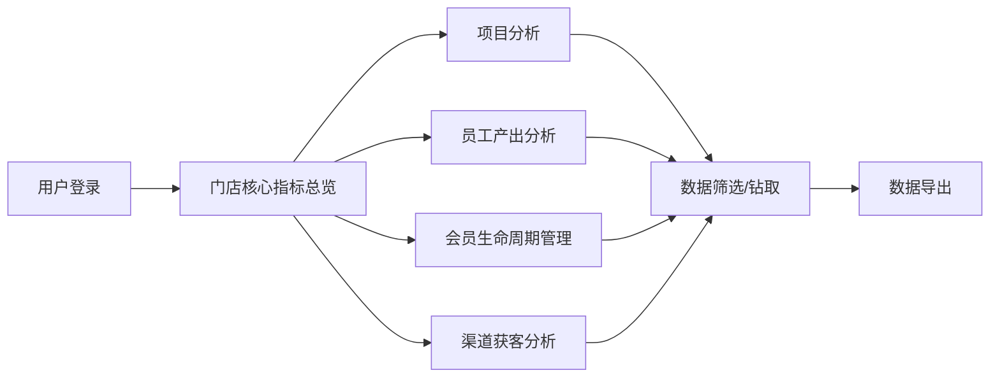

# 美容连锁门店经营分析看板系统 PRD

## 1. 产品概述

美容连锁门店经营分析看板系统是一套面向美容连锁企业的数据分析与决策支持平台，通过可视化图表和多维度分析，帮助管理层实时掌握门店经营状况、项目效益、员工绩效、会员生命周期及渠道获客效果，助力数据驱动的精细化运营。

- **目标用户**：连锁门店运营总监、区域经理、门店店长、市场部负责人
- **核心价值**：多维度经营数据可视化、智能分析预警、辅助经营决策

## 2. 核心功能

### 2.1 用户角色

| 角色 | 登录方式 | 核心权限 |
|------|----------|----------|
| 管理员 | 账号密码登录 | 查看所有门店数据、导出报表、系统配置 |
| 区域经理 | 账号密码登录 | 查看所辖区域门店数据、导出区域报表 |
| 门店店长 | 账号密码登录 | 查看本店数据、员工绩效查看 |

### 2.2 功能模块

1. **门店核心指标分析**：营收、客单价、到店频次、新客数、复购率的综合展示与横向对比
2. **项目分析**：各项目销售额占比、毛利率分析、明星/瘦狗项目识别
3. **员工产出分析**：员工业绩排行、客单数与客单价对比、服务类型绩效
4. **会员生命周期管理**：充值周期、复充率、流失预警
5. **渠道获客分析**：渠道转化率、客单价对比、渠道效果评估

### 2.3 页面详情

| 页面名称 | 模块名称 | 功能描述 |
|----------|----------|----------|
| 门店核心指标页 | 指标卡片 | 展示月度营收、客单价、到店频次、新客数、复购率等KPI卡片 |
| 门店核心指标页 | 排名对比表 | 门店间核心指标横向排名，支持按指标排序筛选 |
| 门店核心指标页 | 趋势图表 | 各门店指标随时间变化的折线图/柱状图 |
| 项目分析页 | 销售占比饼图 | 各项目销售额占比环形图 |
| 项目分析页 | 毛利率柱状图 | 各项目毛利率对比柱状图 |
| 项目分析页 | 四象限矩阵 | 明星/瘦狗项目散点图（销售额 vs 毛利率） |
| 员工产出分析页 | 业绩排行榜 | 美容师/美甲师月度业绩划卡总额排行 |
| 员工产出分析页 | 客单对比图 | 客单数与客单价的双轴对比图表 |
| 员工产出分析页 | 服务类型筛选 | 按服务类型查看员工绩效表现 |
| 会员生命周期页 | 充值周期指标 | 会员平均充值到耗尽的周期统计 |
| 会员生命周期页 | 复充率指标 | 首次充值后3个月内第二次充值的比例 |
| 会员生命周期页 | 流失预警列表 | 连续60天未到店会员标记与列表展示 |
| 渠道获客分析页 | 渠道转化率图 | 美团/抖音/小红书/老客推荐等渠道到店转化率 |
| 渠道获客分析页 | 客单价对比 | 不同渠道客单价差异对比 |
| 渠道获客分析页 | 效果评估表 | 渠道效果综合评分与优化建议提示 |

## 3. 核心流程

用户登录系统后，默认展示门店核心指标总览页面。通过左侧导航栏切换不同分析模块。每个模块支持时间范围筛选、门店筛选等条件。数据可下钻查看明细，支持导出为CSV/Excel格式。

## 4. 用户界面设计

### 4.1 设计风格

- **主色调**：玫瑰金/淡粉色系（#E8A0BF），体现美容行业柔美精致的特质
- **辅助色**：深紫色（#6B5B95）作为强调色，营造高级感
- **背景色**：浅米色渐变（#FFF9F5），温暖舒适
- **卡片风格**：圆角卡片（12px），轻投影，层次分明
- **字体**：标题使用优雅衬线字体，正文使用清晰易读的无衬线字体
- **图表风格**：渐变色填充，圆润曲线，动效流畅

### 4.2 页面设计概览

| 页面名称 | 模块名称 | UI元素 |
|----------|----------|--------|
| 门店核心指标页 | KPI卡片 | 渐变背景卡片，数字+趋势箭头，hover微动效 |
| 门店核心指标页 | 排名表格 | 斑马纹行，排序图标，筛选下拉框 |
| 项目分析页 | 四象限图 | 象限分区背景，散点标注，象限标签 |
| 会员生命周期页 | 流失预警 | 红色预警标签，状态徽标，列表卡片 |
| 全局 | 侧边导航 | 图标+文字，选中态高亮，折叠/展开 |

### 4.3 响应式

- 桌面端（>1200px）：侧边栏+主内容区双栏布局
- 平板端（768-1200px）：侧边栏收起为图标模式
- 移动端（<768px）：顶部导航+底部Tab，内容单列堆叠

### 4.4 数据可视化

- 图表类型：柱状图、折线图、饼图/环形图、散点图、雷达图、双轴图
- 交互：支持hover提示、点击钻取、图例切换、缩放
- 动效：数据加载渐入动画，柱状图上升动画
