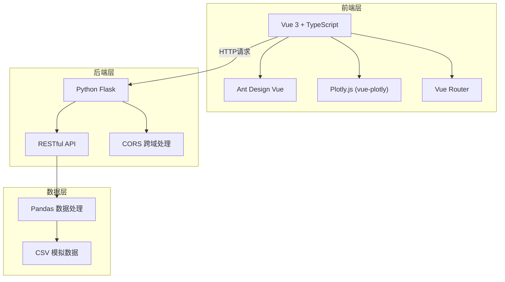
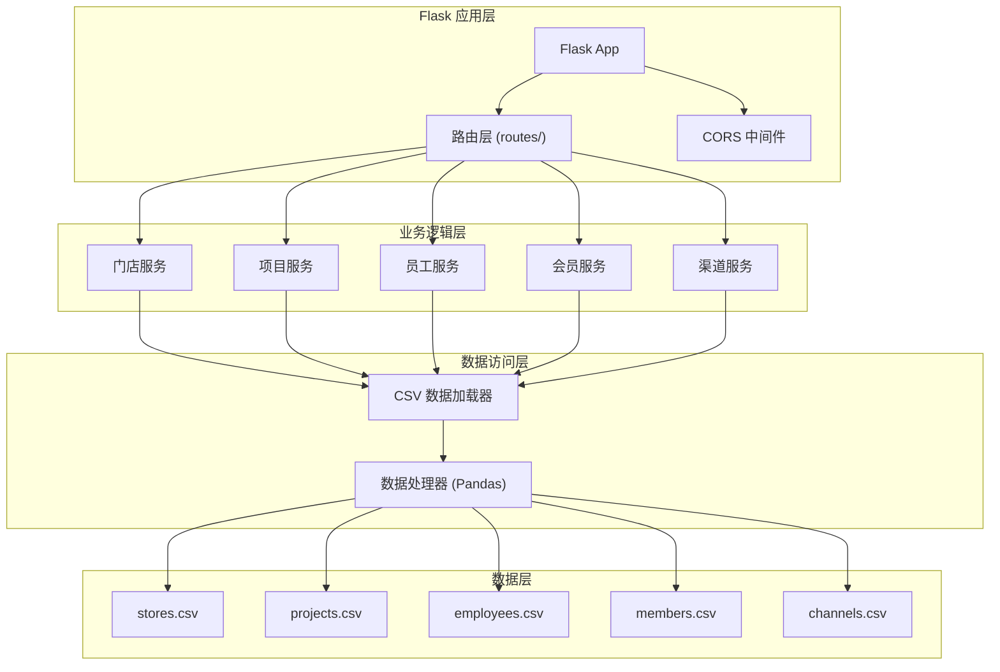
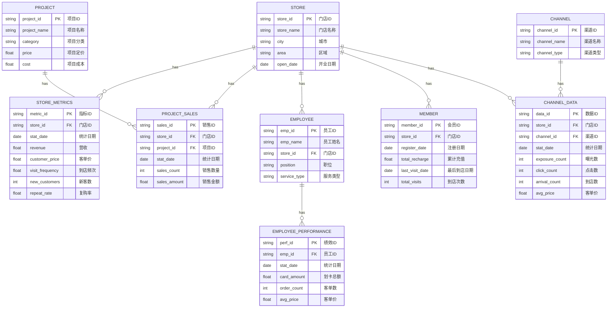

# 美容连锁门店经营分析看板系统 技术架构文档

## 1. 架构设计



## 2. 技术栈说明

| 层级 | 技术选型 | 版本 | 说明 |
|------|----------|------|------|
| 前端框架 | Vue 3 | ^3.4.0 | Composition API + TypeScript |
| UI组件库 | Ant Design Vue | ^4.1.0 | 企业级UI组件库 |
| 图表库 | Plotly.js | ^2.27.0 | 交互式科学图表 |
| 路由 | Vue Router | ^4.2.0 | SPA路由管理 |
| 构建工具 | Vite | ^5.0.0 | 快速开发构建 |
| 后端框架 | Flask | ^3.0.0 | Python轻量Web框架 |
| 数据处理 | Pandas | ^2.0.0 | CSV数据处理分析 |
| 编程语言 | Python | 3.10+ | 后端开发语言 |
| 数据格式 | CSV | - | 模拟数据存储格式 |

## 3. 路由定义

| 路由路径 | 页面名称 | 说明 |
|----------|----------|------|
| / | 重定向到门店分析 | 默认首页重定向 |
| /store-analysis | 门店核心指标分析 | 门店KPI、排名对比、趋势图 |
| /project-analysis | 项目分析 | 项目占比、毛利率、四象限 |
| /employee-analysis | 员工产出分析 | 业绩排行、客单对比 |
| /member-lifecycle | 会员生命周期管理 | 充值周期、复充率、流失预警 |
| /channel-analysis | 渠道获客分析 | 渠道转化、客单价对比 |

## 4. API 接口定义

### 4.1 接口规范

- 协议：HTTP/HTTPS
- 数据格式：JSON
- 基础路径：`/api/v1`
- 响应格式：

```typescript
interface ApiResponse<T> {
  code: number;       // 200: 成功, 400: 参数错误, 500: 服务器错误
  message: string;    // 状态信息
  data: T;            // 响应数据
}
```

### 4.2 接口列表

| 接口路径 | 方法 | 说明 |
|----------|------|------|
| /stores/metrics | GET | 获取门店核心指标数据 |
| /stores/ranking | GET | 获取门店排名对比数据 |
| /stores/trend | GET | 获取门店指标趋势数据 |
| /projects/sales | GET | 获取项目销售占比数据 |
| /projects/margin | GET | 获取项目毛利率数据 |
| /projects/matrix | GET | 获取项目四象限矩阵数据 |
| /employees/ranking | GET | 获取员工业绩排行数据 |
| /employees/orders | GET | 获取员工客单数与客单价数据 |
| /members/cycle | GET | 获取会员充值周期数据 |
| /members/recharge | GET | 获取会员复充率数据 |
| /members/churn | GET | 获取流失预警会员列表 |
| /channels/conversion | GET | 获取渠道转化率数据 |
| /channels/aov | GET | 获取渠道客单价对比数据 |
| /channels/evaluation | GET | 获取渠道效果评估数据 |
| /export/{module} | GET | 导出指定模块数据 |

### 4.3 通用查询参数

| 参数名 | 类型 | 必填 | 说明 |
|--------|------|------|------|
| startDate | string | 否 | 开始日期 (YYYY-MM-DD) |
| endDate | string | 否 | 结束日期 (YYYY-MM-DD) |
| storeIds | string | 否 | 门店ID，逗号分隔 |
| sortBy | string | 否 | 排序字段 |
| sortOrder | string | 否 | 排序方向 (asc/desc) |

## 5. 后端架构图



## 6. 数据模型

### 6.1 数据模型定义



### 6.2 CSV 文件结构

| 文件名 | 说明 | 主要字段 |
|--------|------|----------|
| stores.csv | 门店主数据 | store_id, store_name, city, area, open_date |
| store_metrics.csv | 门店月度指标 | store_id, stat_month, revenue, customer_price, visit_frequency, new_customers, repeat_rate |
| projects.csv | 项目主数据 | project_id, project_name, category, price, cost |
| project_sales.csv | 项目销售数据 | store_id, project_id, stat_month, sales_count, sales_amount |
| employees.csv | 员工主数据 | emp_id, emp_name, store_id, position, service_type |
| employee_performance.csv | 员工绩效数据 | emp_id, store_id, stat_month, card_amount, order_count, avg_price |
| members.csv | 会员数据 | member_id, store_id, register_date, total_recharge, last_visit_date, total_visits, recharge_cycle_days, recharged_in_90d |
| channels.csv | 渠道主数据 | channel_id, channel_name, channel_type |
| channel_data.csv | 渠道数据 | store_id, channel_id, stat_month, exposure_count, click_count, arrival_count, avg_price |

## 7. 前端目录结构

```
src/
├── components/          # 公共组件
│   ├── charts/         # 图表组件
│   ├── layout/         # 布局组件
│   └── common/         # 通用组件
├── pages/              # 页面组件
│   ├── StoreAnalysis.vue
│   ├── ProjectAnalysis.vue
│   ├── EmployeeAnalysis.vue
│   ├── MemberLifecycle.vue
│   └── ChannelAnalysis.vue
├── api/                # API 接口
│   ├── request.ts      # 请求封装
│   ├── store.ts
│   ├── project.ts
│   ├── employee.ts
│   ├── member.ts
│   └── channel.ts
├── types/              # TypeScript 类型定义
├── utils/              # 工具函数
├── router/             # 路由配置
├── assets/             # 静态资源
└── App.vue
```

## 8. 后端目录结构

```
backend/
├── app.py              # Flask 应用入口
├── requirements.txt    # Python 依赖
├── routes/             # 路由模块
│   ├── __init__.py
│   ├── store_routes.py
│   ├── project_routes.py
│   ├── employee_routes.py
│   ├── member_routes.py
│   └── channel_routes.py
├── services/           # 业务逻辑层
│   ├── __init__.py
│   ├── store_service.py
│   ├── project_service.py
│   ├── employee_service.py
│   ├── member_service.py
│   └── channel_service.py
├── data/               # CSV 数据目录
│   ├── stores.csv
│   ├── store_metrics.csv
│   ├── projects.csv
│   ├── project_sales.csv
│   ├── employees.csv
│   ├── employee_performance.csv
│   ├── members.csv
│   ├── channels.csv
│   └── channel_data.csv
└── utils/              # 工具模块
    ├── __init__.py
    ├── csv_loader.py
    └── data_processor.py
```
