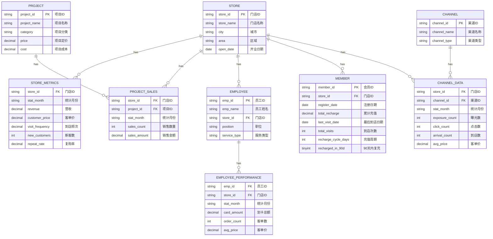

# 美容连锁门店经营分析看板系统 - 数据库设计文档

## 1. 概述

本文档描述了美容连锁门店经营分析看板系统的数据模型设计。系统当前使用 CSV 文件作为数据存储，便于开发和测试。未来可迁移至关系型数据库（如 MySQL、PostgreSQL）。

## 2. 数据模型总览

系统包含以下核心数据实体：
- 门店（Store）
- 门店指标（Store Metrics）
- 项目（Project）
- 项目销售（Project Sales）
- 员工（Employee）
- 员工绩效（Employee Performance）
- 会员（Member）
- 渠道（Channel）
- 渠道数据（Channel Data）

## 3. 详细数据字典

### 3.1 门店表 (stores)

| 字段名 | 类型 | 必填 | 说明 | 示例 |
|--------|------|------|------|------|
| store_id | VARCHAR(32) | 是 | 门店ID，主键 | S001 |
| store_name | VARCHAR(100) | 是 | 门店名称 | 朝阳旗舰店 |
| city | VARCHAR(50) | 是 | 所在城市 | 北京 |
| area | VARCHAR(50) | 否 | 所在区域 | 朝阳区 |
| open_date | DATE | 是 | 开业日期 | 2022-03-15 |

### 3.2 门店月度指标表 (store_metrics)

| 字段名 | 类型 | 必填 | 说明 | 示例 |
|--------|------|------|------|------|
| store_id | VARCHAR(32) | 是 | 门店ID，外键 | S001 |
| stat_month | VARCHAR(7) | 是 | 统计月份 | 2024-01 |
| revenue | DECIMAL(12,2) | 是 | 月度营收（元） | 856230.50 |
| customer_price | DECIMAL(10,2) | 是 | 客单价（元） | 398.50 |
| visit_frequency | DECIMAL(4,2) | 是 | 到店频次（次/月/人） | 3.25 |
| new_customers | INT | 是 | 新客数 | 85 |
| repeat_rate | DECIMAL(5,4) | 是 | 老客复购率 | 0.6776 |

**主键**: (store_id, stat_month)

### 3.3 项目表 (projects)

| 字段名 | 类型 | 必填 | 说明 | 示例 |
|--------|------|------|------|------|
| project_id | VARCHAR(32) | 是 | 项目ID，主键 | P001 |
| project_name | VARCHAR(100) | 是 | 项目名称 | 面部清洁护理 |
| category | VARCHAR(50) | 是 | 项目分类 | 皮肤管理 |
| price | DECIMAL(10,2) | 是 | 项目定价（元） | 298.00 |
| cost | DECIMAL(10,2) | 是 | 项目成本（元） | 85.00 |

**项目分类枚举**:
- 皮肤管理
- 抗衰紧致
- 脱毛
- 纹绣
- 美甲美睫

### 3.4 项目销售表 (project_sales)

| 字段名 | 类型 | 必填 | 说明 | 示例 |
|--------|------|------|------|------|
| store_id | VARCHAR(32) | 是 | 门店ID，外键 | S001 |
| project_id | VARCHAR(32) | 是 | 项目ID，外键 | P001 |
| stat_month | VARCHAR(7) | 是 | 统计月份 | 2024-01 |
| sales_count | INT | 是 | 销售数量 | 156 |
| sales_amount | DECIMAL(12,2) | 是 | 销售金额（元） | 45620.00 |

**主键**: (store_id, project_id, stat_month)

### 3.5 员工表 (employees)

| 字段名 | 类型 | 必填 | 说明 | 示例 |
|--------|------|------|------|------|
| emp_id | VARCHAR(32) | 是 | 员工ID，主键 | E001 |
| emp_name | VARCHAR(50) | 是 | 员工姓名 | 张美丽 |
| store_id | VARCHAR(32) | 是 | 所属门店ID，外键 | S001 |
| position | VARCHAR(50) | 是 | 职位 | 高级美容师 |
| service_type | VARCHAR(50) | 是 | 服务类型 | 皮肤管理 |

**职位枚举**:
- 店长
- 高级美容师
- 美容师
- 美甲师
- 纹绣师

**服务类型枚举**:
- 皮肤管理
- 抗衰紧致
- 脱毛
- 纹绣
- 美甲美睫

### 3.6 员工绩效表 (employee_performance)

| 字段名 | 类型 | 必填 | 说明 | 示例 |
|--------|------|------|------|------|
| emp_id | VARCHAR(32) | 是 | 员工ID，外键 | E001 |
| store_id | VARCHAR(32) | 是 | 门店ID，外键 | S001 |
| stat_month | VARCHAR(7) | 是 | 统计月份 | 2024-01 |
| card_amount | DECIMAL(12,2) | 是 | 划卡总额（元） | 58620.00 |
| order_count | INT | 是 | 客单数 | 128 |
| avg_price | DECIMAL(10,2) | 是 | 客单价（元） | 457.97 |

**主键**: (emp_id, stat_month)

### 3.7 会员表 (members)

| 字段名 | 类型 | 必填 | 说明 | 示例 |
|--------|------|------|------|------|
| member_id | VARCHAR(32) | 是 | 会员ID，主键 | M00001 |
| store_id | VARCHAR(32) | 是 | 所属门店ID，外键 | S001 |
| register_date | DATE | 是 | 注册日期 | 2023-06-15 |
| total_recharge | DECIMAL(12,2) | 是 | 累计充值金额（元） | 15800.00 |
| last_visit_date | DATE | 是 | 最后到店日期 | 2024-12-10 |
| total_visits | INT | 是 | 累计到店次数 | 45 |
| recharge_cycle_days | INT | 是 | 平均充值周期（天） | 95 |
| recharged_in_90d | TINYINT(1) | 是 | 90天内是否复充 | 1 |

### 3.8 渠道表 (channels)

| 字段名 | 类型 | 必填 | 说明 | 示例 |
|--------|------|------|------|------|
| channel_id | VARCHAR(32) | 是 | 渠道ID，主键 | C001 |
| channel_name | VARCHAR(50) | 是 | 渠道名称 | 美团 |
| channel_type | VARCHAR(50) | 是 | 渠道类型 | 本地生活 |

**渠道类型枚举**:
- 本地生活
- 短视频
- 社交种草
- 口碑传播
- 社交媒体

### 3.9 渠道数据表 (channel_data)

| 字段名 | 类型 | 必填 | 说明 | 示例 |
|--------|------|------|------|------|
| store_id | VARCHAR(32) | 是 | 门店ID，外键 | S001 |
| channel_id | VARCHAR(32) | 是 | 渠道ID，外键 | C001 |
| stat_month | VARCHAR(7) | 是 | 统计月份 | 2024-01 |
| exposure_count | INT | 是 | 曝光数 | 8500 |
| click_count | INT | 是 | 点击数 | 850 |
| arrival_count | INT | 是 | 到店数 | 32 |
| avg_price | DECIMAL(10,2) | 是 | 客单价（元） | 420.50 |

**主键**: (store_id, channel_id, stat_month)

## 4. 实体关系图

## 5. 索引设计

| 表名 | 索引名 | 字段 | 类型 | 说明 |
|------|--------|------|------|------|
| store_metrics | idx_store_month | store_id, stat_month | PRIMARY | 门店月份联合主键 |
| store_metrics | idx_month | stat_month | NORMAL | 按月查询 |
| project_sales | idx_store_project_month | store_id, project_id, stat_month | PRIMARY | 联合主键 |
| project_sales | idx_project | project_id | NORMAL | 按项目查询 |
| employee_performance | idx_emp_month | emp_id, stat_month | PRIMARY | 员工月份联合主键 |
| employee_performance | idx_store_month | store_id, stat_month | NORMAL | 按门店月份查询 |
| members | idx_store | store_id | NORMAL | 按门店查询 |
| members | idx_last_visit | last_visit_date | NORMAL | 按最后到店日期查询 |
| channel_data | idx_store_channel_month | store_id, channel_id, stat_month | PRIMARY | 联合主键 |
| channel_data | idx_channel | channel_id | NORMAL | 按渠道查询 |

## 6. CSV 数据文件清单

| 文件名 | 对应表 | 记录数（示例） | 说明 |
|--------|--------|---------------|------|
| stores.csv | stores | 8 | 门店主数据 |
| store_metrics.csv | store_metrics | 96 | 8家门店×12个月 |
| projects.csv | projects | 10 | 项目主数据 |
| project_sales.csv | project_sales | 960 | 8门店×10项目×12月 |
| employees.csv | employees | 68 | 员工主数据 |
| employee_performance.csv | employee_performance | 816 | 68员工×12个月 |
| members.csv | members | 2210 | 会员数据 |
| channels.csv | channels | 6 | 渠道主数据 |
| channel_data.csv | channel_data | 576 | 8门店×6渠道×12月 |

## 7. 数据库迁移建议

若需从 CSV 迁移至关系型数据库，建议按以下步骤进行：

1. **创建表结构**: 按照本设计文档创建所有数据表
2. **导入基础数据**: 先导入门店、项目、员工、渠道等主数据
3. **导入业务数据**: 再导入指标、销售、绩效、会员、渠道等业务数据
4. **建立索引**: 按索引设计建立必要的索引
5. **数据校验**: 验证数据完整性和一致性
6. **性能优化**: 根据实际查询需求优化索引和查询语句
